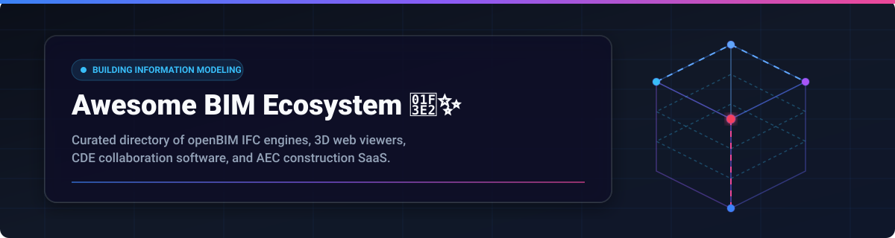

 

# 🏗️ Awesome Building Information Modeling (BIM) Ecosystem

Welcome to the definitive, curated directory of **Building Information Modeling (BIM)** software, openBIM standards, 3D Web Assembly viewers, Common Data Environments (CDE), and AEC (Architecture, Engineering & Construction) collaboration platforms.

Whether you are an architect, structural engineer, BIM manager, AEC software developer, or construction technologist, this list brings together top-tier commercial **SaaS platforms** and production-grade **open-source GitHub projects**.

---

## 📑 Table of Contents
- [🌐 SaaS/Hosted Platforms](#-saashosted-platforms)
- [🔓 Open-Source GitHub Projects](#-open-source-github-projects)
- [🤝 How to Contribute](#-how-to-contribute)
- [📈 Star History](#-star-history)
- [💖 Support & Sponsorship](#-support--sponsorship)
- [⚖️ Disclaimer](#%EF%B8%8F-disclaimer)

---

## 🌐 SaaS/Hosted Platforms

> 📊 **Market Insights**: The global Building Information Modeling (BIM) software sector is valued at **~$9.8 Billion in 2026** and projected to reach **~$15.2 Billion by 2030** (CAGR ~13.5%). The market structure is **moderately fragmented**: dominated by legacy category anchors (Autodesk, Hexagon, Trimble) at the enterprise core, alongside a vibrant ecosystem of specialized best-of-breed cloud SaaS platforms for reality capture, issue tracking, and automated model coordination.

The following SaaS platforms enable cloud design co-authoring, automated clash detection, ISO 19650 CDE compliance, and mobile field BIM execution. Table is ordered by company market capitalization / valuation (descending).

| 🏢 Product Name | 📝 Description | 💳 Pricing (Starting Tier) | 🎁 Free Tier / Trial Limit | 💰 Company Size / Valuation / Revenue |
| :--- | :--- | :--- | :--- | :--- |
| **[Bricsys 24/7](https://www.bricsys.com/247/)** | Cloud Common Data Environment (CDE) with ISO 19650 workflow automation, role-based access, and mobile viewing. | **$240/month** ($2,880/yr for 20 users) | **30-Day Free Trial** (Full platform features & unlimited test users) | **$5.60B Revenue** / $30B Valuation *(Hexagon AB)* |
| **[Autodesk BIM Collaborate](https://www.autodesk.com/products/bim-collaborate/overview)** | Autodesk Construction Cloud design co-authoring, automated model clash detection, and connected Revit/Navisworks issues. | **$705/user/year** (or ~$90/user/month) | **30-Day Free Trial** (Full project features, up to 10 team members) | **$5.50B Revenue** / $55B Market Cap *(Autodesk ADSK)* |
| **[Trimble Connect](https://connect.trimble.com/)** | Open CDE supporting 60+ AEC formats, live browser/desktop co-design sessions, and Tekla/Revit integration. | **$12.99/user/month** ($120/year) | **Personal Free Plan** (1 active project, 10 GB cloud storage, 5 collaborators) | **$3.80B Revenue** / $16B Market Cap *(Trimble TRMB)* |
| **[OpenSpace BIM](https://www.openspace.ai/)** | AI-powered 360° reality capture platform with split-view temporal site progression and 3D BIM overlay. | **$5,000/project/year** (Base project tier) | **14-Day Interactive Trial** (Full demo site model & photo capture sandbox) | **$902M Valuation** (Series D Unicorn / ~$50M ARR) |
| **[Dalux](https://www.dalux.com/)** | Construction management suite with dynamic mobile 3D BIM viewer, QR-code plan verification, and site tasks. | **$150/user/month** (Dalux Field & Box paid plan) | **Dalux Box Free Plan** (1 active project, unlimited users, max 50 MB files) | **$500M Valuation** (~$100M ARR) |
| **[Revizto](https://revizto.com/)** | Integrated 2D/3D issue tracking and coordination workspace with offline field sync and real-time Revizto Editor. | **$450/user/year** (Min $5,000/yr 10-user team bundle) | **14-Day Free Trial** (Full project sandbox & issue tracker access) | **$300M Valuation** (~$60M ARR) |
| **[BIM Track](https://bimtrack.co/)** | OpenBIM communication hub with BCF issue tracking directly inside Revit, Navisworks, Tekla, AutoCAD, and Solibri. | **$99/month** (Base tier for up to 10 users) | **14-Day Free Trial** (Full feature access, unlimited team members) | **$200M Valuation** (~$40M Revenue / *Newforma*) |
| **[BIMcollab](https://www.bimcollab.com/)** | Ecosystem combining Model Quality Assurance and ISO 19650 CDE solutions with BCF issue management. | **€119/month** (~$130/mo for 10 users) | **BIMcollab Free Plan** (1 active project, up to 4 users) | **$150M Valuation** (~$30M ARR) |
| **[Catenda Hub](https://catenda.com/)** | Native openBIM CDE supporting ISO 19650 naming conventions, BCF issue tracking, and unlimited platform users. | **€190/month** (~$210/mo for 5 core users) | **14-Day Free Trial** (Unlimited projects & test users during trial) | **$75M Valuation** (~$15M ARR) |
| **[Novorender](https://novorender.com/)** | Cloud BIM repository & WebGL engine rendering multi-gigabyte models instantly with automated clash and rule checks. | **$350/month** (Base workspace organization plan) | **30-Day Free Trial** (1 workspace with 3D model streaming sandbox) | **$50M Valuation** (~$10M ARR) |

---

## 🔓 Open-Source GitHub Projects

Open-source projects provide vendor-independent IFC parsing engines, WebGL/WebGPU 3D viewers, parametric modelers, and real-time CRDT collaboration layers. Sorted by **GitHub_Stars_Count** (descending).

- **[FreeCAD BIM Workbench](https://github.com/FreeCAD/FreeCAD)**   
  *Free, open-source parametric 3D CAD modeling software with native IFC import/export, structural framing, reinforcement tools, and architectural BIM workbench.* 🛠️

- **[OpenProject BIM](https://github.com/opf/openproject)**   
  *Web-based open-source construction project management suite featuring integrated 3D IFC model viewing, BCF issue management, and Revit workflow integration.* 📋

- **[Online 3D Viewer](https://github.com/kovacsv/Online3DViewer)**   
  *Zero-dependency browser 3D model viewer supporting IFC, BIM, STEP, STL, OBJ, glTF, and 3DM formats with instant geometry rendering and format export.* 👁️

- **[Trimesh](https://github.com/mikedh/trimesh)**   
  *Pure Python library for loading, processing, and inspecting 3D triangular meshes with geometric analysis, boolean operations, and IFC mesh extraction.* 🐍

- **[IfcOpenShell / Bonsai](https://github.com/IfcOpenShell/IfcOpenShell)**   
  *The de-facto open-source IFC C++ and Python framework powering native IFC authoring via Bonsai (Blender add-on), IfcConvert, IfcClash, IfcCSV, and IfcTester.* 🌳

- **[BIMserver](https://github.com/opensourceBIM/BIMserver)**   
  *Model-driven open-source BIM database server enabling storage, querying, merging, checking, and object-level version control for IFC construction data.* 🗄️

- **[web-ifc / That Open Engine](https://github.com/ThatOpen/engine_web-ifc)**   
  *High-speed JavaScript/WASM IFC parsing engine by That Open Company, parsing IFC model geometry and properties client-side directly into Three.js.* ⚡

- **[OpenConstructionERP](https://github.com/datadrivenconstruction/OpenConstructionERP)**   
  *Independent open-source ERP for construction with browser federated 3D BIM viewer, automated clash detection with BCF export, and BOQ estimation.* 🏗️

- **[Speckle Server](https://github.com/specklesystems/speckle-server)**   
  *Open-source object-based data platform for AEC geometry, providing Git-like versioning, GraphQL APIs, and real-time connectors for Revit, Rhino, and Grasshopper.* 🔄

- **[xeokit-bim-viewer](https://github.com/xeokit/xeokit-bim-viewer)**   
  *Production-grade 3D WebGL BIM and point cloud viewer built on xeokit SDK, featuring double-precision coordinates for AEC/GIS split-model rendering.* 📐

- **[ifc-lite](https://github.com/LTplus-AG/ifc-lite)**   
  *Rust + WASM engine for fast IFC parsing, WebGPU browser rendering, SQL DuckDB queries, and CRDT-based multi-user concurrent model editing.* 🦀

- **[Bldrs Share](https://github.com/bldrs-ai/Share)**   
  *Browser BIM & CAD viewer with zero data upload, offline local loading, property editing, CSV export, and multi-user Git timeline collaboration.* 🌐

- **[GomeraX](https://github.com/salpbes/GomeraX)**   
  *Experimental WebGPU IFC viewer with local AI assistant, IFC Fragment conversion, 2D floor plan rendering, and automatic site coordinate alignment.* 🤖

- **[Open Planner Studio](https://github.com/OpenAEC-Foundation/open-planner-studio)**   
  *Open-source 4D BIM construction planning tool supporting native IFC 4.3 models, Gantt charts, CPM path analysis, and Work Breakdown Structures.* 📅

- **[ConvergeStudio](https://github.com/wieslawsoltes/ConvergeStudio)**   
  *Browser-based BIM coordination and clash detection tool with micrometre epsilon precision, section planes, and stable entity-pair status tracking.* 🎯

---

## 🤝 How to Contribute

Contributions are welcome and appreciated! Follow these steps to submit a project:

1. 🍴 **Fork** this repository.
2. 📝 **Add/Update** entries in `README.md` following the exact table or bullet format.
3. 🔗 Ensure all links lead directly to official websites or GitHub repositories.
4. 🚀 **Submit a Pull Request** with a concise description of your additions.

Please review [Awesome-Awesome-Awesome](https://github.com/ishandutta2007/Awesome-Awesome-Awesome) guidelines for awesome list standards.

---

## 📈 Star History

---

## 💖 Support & Sponsorship

If you find this repository helpful for your AEC research, BIM project, or software development, please consider showing your support:

- ⭐ **Star** this repository to increase visibility.
- 🔀 **Fork** it to keep a copy and contribute back.
- 📢 **Share** it with fellow architects, engineers, and developers.
- ☕ **Buy Me a Coffee / Sponsor**: Support ongoing maintenance via [GitHub Sponsors](https://github.com/sponsors/ishandutta2007).

Thank you for helping build an open, collaborative BIM ecosystem! 🙏

---

## ⚖️ Disclaimer

- This is a community-curated directory for informational purposes only.
- Listed BIM software and OpenBIM tools must comply with project-specific ISO 19650 standards, buildingSMART requirements, and security policies.
- Trademarks and logos belong to their respective owners.
